## Our Mission

Our mission is to harness the transformative potential of AI and NLP technologies while actively mitigating their risks, ensuring they are developed and used in an ethical, transparent, and accountable manner.

We are committed to building a safer and more reliable future for artificial intelligence, a future where powerful language models can be trusted by the people and organizations that rely on them.

---

## Our Approach:

**Effective Altruism** is a philosophical and social movement that aims to benefit others as much as possible through evidence and careful reasoning. Its core goal is to allocate limited resources (time, expertise, and funding) in the ways that create the highest positive impact.

At SafeNLP, we apply this principle directly to AI: we focus our work where it matters most, tackling the problems in artificial intelligence that pose the greatest risks and solving them in ways that contribute to a safer, more responsible development of the technology.

<blockquote class="safenlp-quote">

We ask not just <strong>"can we build this?"</strong> but <strong>"where does our effort do the most good?"</strong> We let that answer guide our research priorities, collaborations, and community.

</blockquote>

---

## Our Community in Action

<link rel="stylesheet" href="https://cdn.jsdelivr.net/npm/glightbox@3.3.0/dist/css/glightbox.min.css" />

<a href="images/gallery/about/IMG_20260201_180121.jpg" class="glightbox photo-hero" data-gallery="about" data-description="SafeNLP community">
  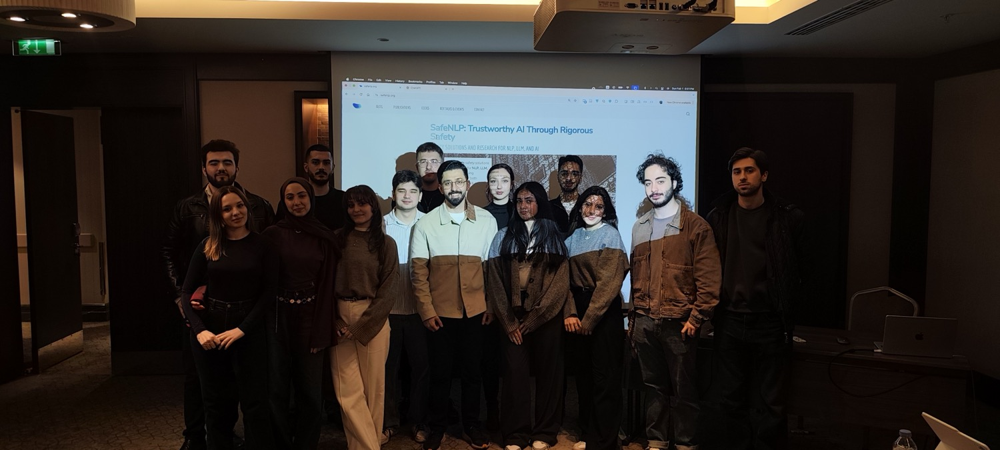
</a>

  <a href="images/gallery/about/IMG_8346.jpg" class="glightbox" data-gallery="about" data-description="SafeNLP community">
    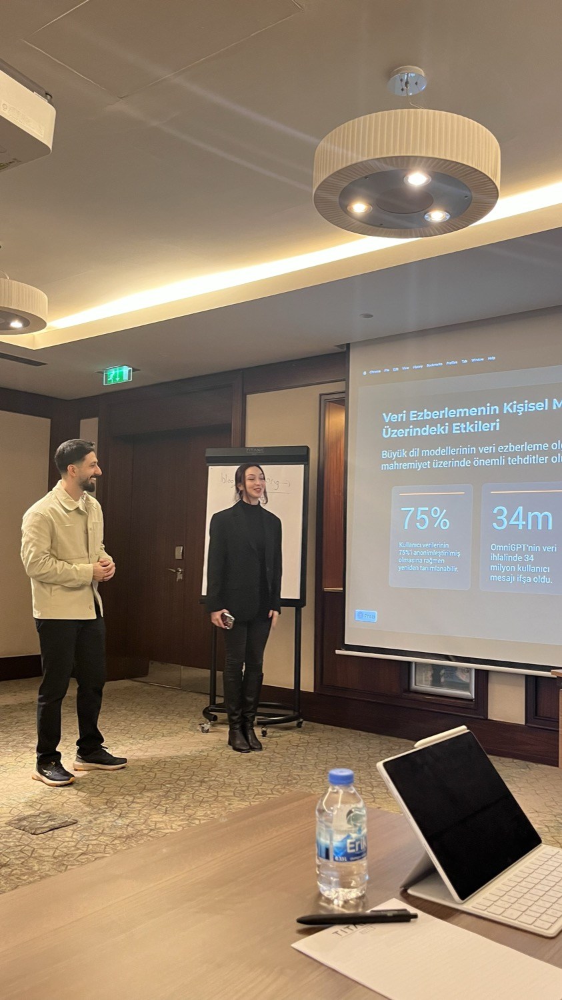
  </a>

  <a href="images/gallery/about/IMG_8493.jpg" class="glightbox" data-gallery="about" data-description="SafeNLP community">
    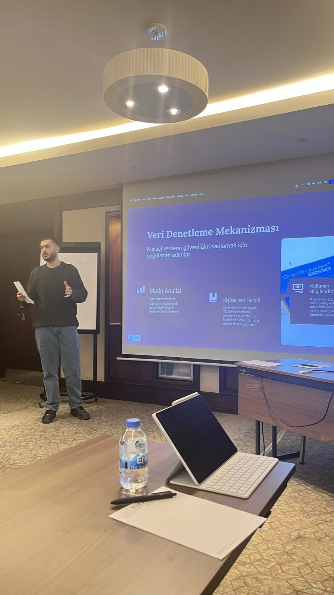
  </a>

  <a href="images/gallery/about/IMG_8353.jpg" class="glightbox" data-gallery="about" data-description="SafeNLP community">
    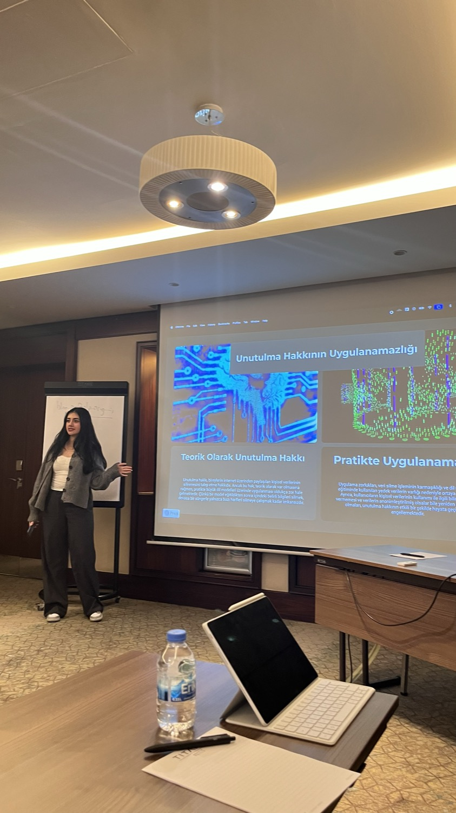
  </a>

  <a href="images/gallery/about/IMG_20260201_171352.jpg" class="glightbox" data-gallery="about" data-description="SafeNLP community">
    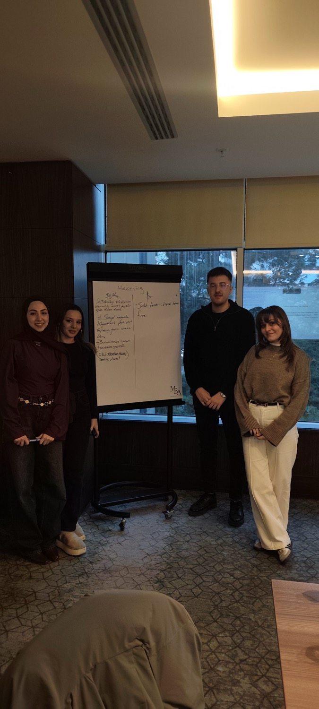
  </a>

  <a href="images/gallery/about/IMG_8511.jpg" class="glightbox" data-gallery="about" data-description="SafeNLP community">
    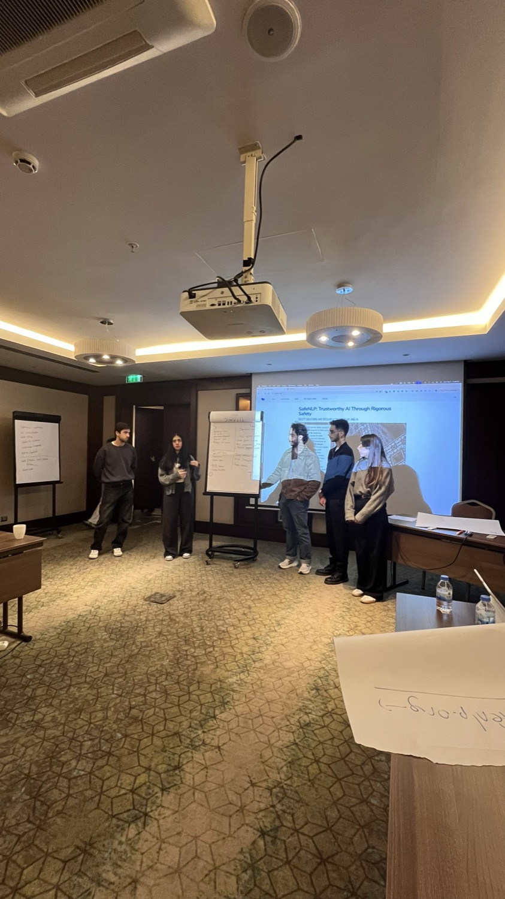
  </a>

  <a href="images/gallery/about/IMG_7086.jpg" class="glightbox" data-gallery="about" data-description="SafeNLP community">
    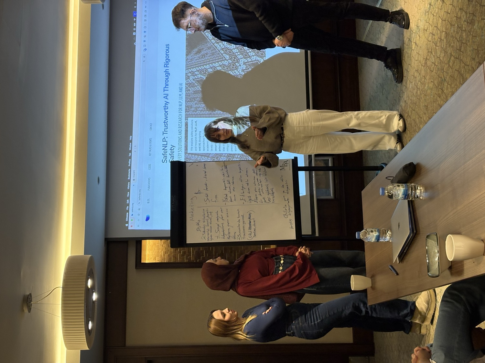
  </a>

  <a href="images/gallery/about/IMG_0325.jpg" class="glightbox" data-gallery="about" data-description="SafeNLP community">
    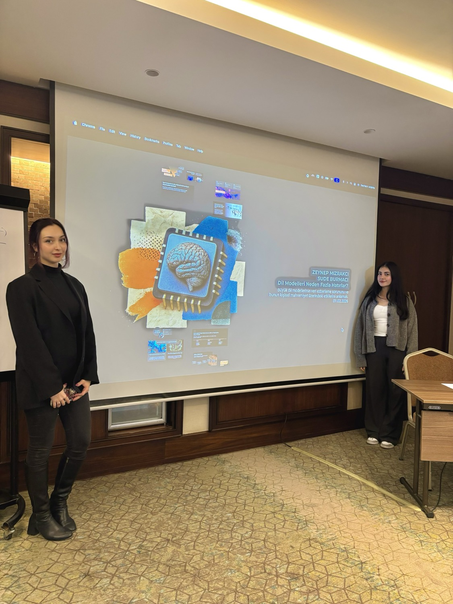
  </a>

  <a href="images/gallery/about/IMG_7420.jpg" class="glightbox" data-gallery="about" data-description="SafeNLP community">
    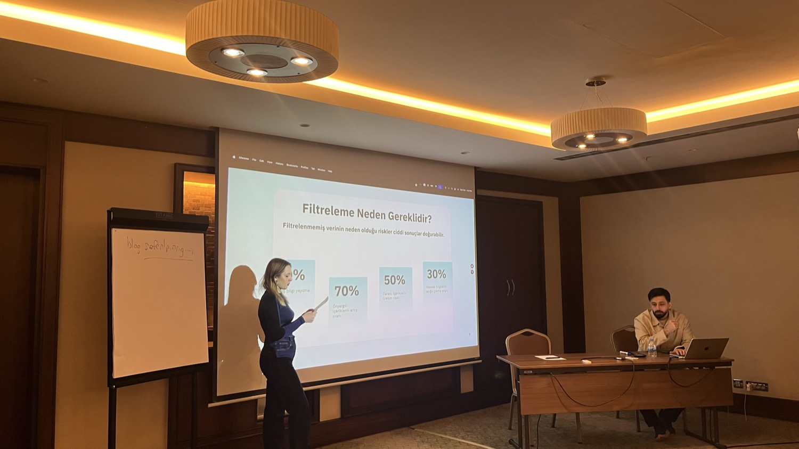
  </a>

  <a href="images/gallery/about/IMG_0326.jpg" class="glightbox" data-gallery="about" data-description="SafeNLP community">
    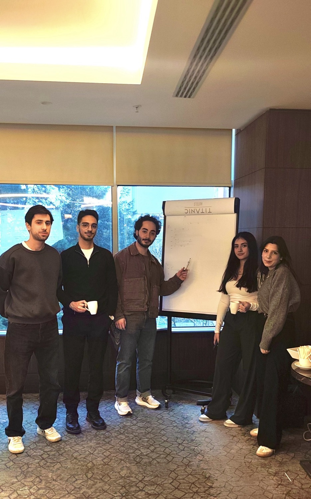
  </a>

  <a href="images/gallery/about/IMG_8314.jpg" class="glightbox" data-gallery="about" data-description="SafeNLP community">
    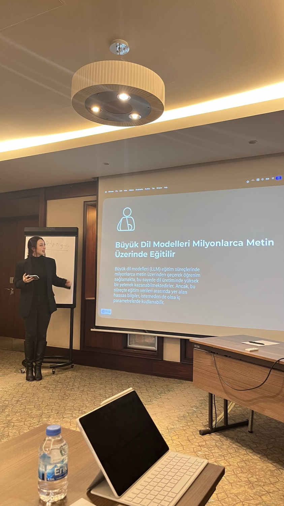
  </a>

